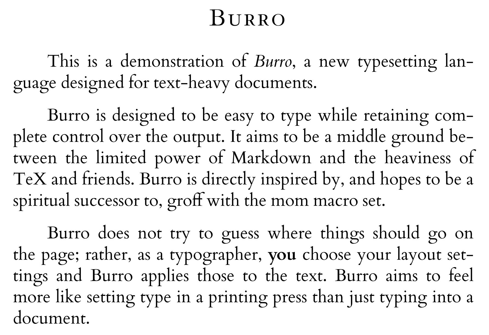

# Burro

A digital typesetting language that's easy to type.

## Demo

```
.margins[2in]
.pt_size[12]
.start
.align[center]

.pt_size[18]
.bold[Burro]

.align[justify]
; Lines beginning with a ; are commented out 
; (i.e., they have no effect on the output)
; The "-" argument resets the value of this command 
; to its previous value (here, 12 pts)
.pt_size[-]
This is a demonstration of .italic[Burro], a new typesetting language 
designed for text-heavy documents.

Burro is designed to be easy to type while retaining complete control 
over the output. It aims to be a middle ground between the limited power 
of Markdown and the heaviness of TeX and friends. 
Burro is directly inspired by, and hopes to be a spiritual successor to, 
groff with the mom macro set. 

Burro does not try to guess where things should go on the page; 
rather, as a typographer, .italic[you] choose your layout settings 
and Burro applies those to the text. 
Burro aims to feel more like setting type in a printing press 
than just typing into a document.
```



## Vision

Burro is an attempt to find a middle ground between the verbosity of [`TeX`](http://tug.org), the excessive newlines of [`groff`](https://www.gnu.org/software/groff/), and the limited flexibility and power of compiling to a PDF from Markdown. A fundamental guiding principle is that the language _should be easy to type_, since it is, well, a typesetting language. 

Burro is meant for easy typesetting of mostly-text documents (i.e., it makes no attempt to replace TeX and friends for scientific documents). Burro is directly inspired by, and aims to be a spiritual successor to, [`groff`](https://www.gnu.org/software/groff/) with the [`mom`](http://www.schaffter.ca/mom/) macro set. 

It is also important that the user should have easy yet complete control over where everything goes on the page. Burro aims to have sensible defaults (mostly taken from Bringhurst's classic _The Elements of Typographic Style_) that can all be customized, anywhere in the document.

## Why Burro when TeX exists?

TeX has been the gold standard of digital typography for the past several decades, so Burro has a high standard to reach! Burro is __not__ intended to be a toy poject but a instead a fully capable competitor to TeX--at least within its own domain. Burro intentionally restricts that domain to __text__ douments. (In other words, for your latest math homework, just use LaTeX!)

Rather than trying to find the optimal layout using its own idea of typographic beauty, Burro puts those choices in your hands. Burro looks at the current document settings: margins, page dimensions, spacing, leading, etc., and applies those to the input text, just as a typographer setting text in a printing press would do. You, as the typographer, have the freedom to change those settings at any point in the document. 

Notably, Burro does not concern itself with ideas like floating blocks. Instead, Burro will happily put content on top of existing content if that is what it's told to do. To avoid this, the typographer must specify different sections and positions where the text should be written. While this system may seem odd to those used to an automatic layout algorithm, it opens up a surprisingly powerful amount of typographic freedom.

## Usage

For now, Burro requires a font map, telling it where to find font files for each family/font combination it encounters. See `examples/fontmap` for the necessary syntax.

Saved as `example.bur`, this file can be compiled with `burro example.bur` (assuming the fontmap is stored next to `example.bur`). The command will output `example.pdf`. 

## Project History

I first worked on Burro in 2018, but couldn't settle on a syntax I liked, so the project sat dormant for some time. This latest rewrite is already more powerful than the original version was, and has a much more flexible and pleasant syntax.

## Roadmap

These are many more features planned for Burro, including an extensive list of typographic commands, user defined variables, and more. See the file `examples/syntax.bur` for some of the current long term vision. Burro is not yet tested on non-Latin scripts (or even non-English languages), but good international support is a blocker for the 1.0 release.

Burro is currently undocumented beyond the `examples` directory, but that will improve over time.
